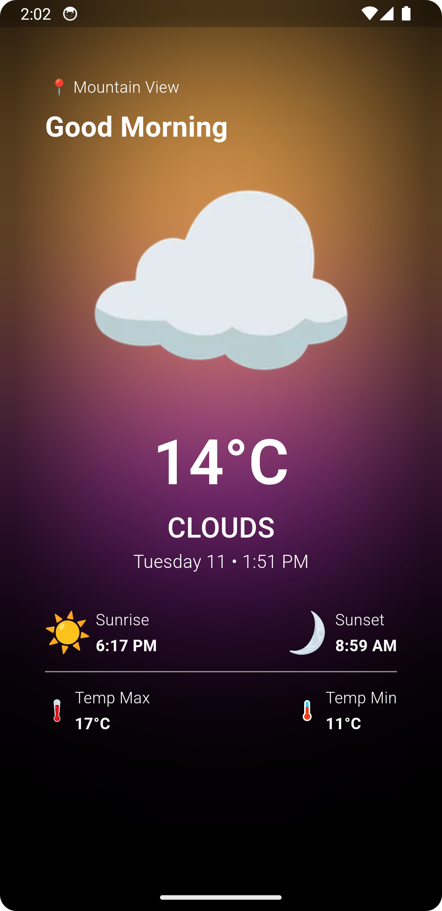

# Weatherapp

A live weather app with dynamic functionality of updating itself occurding to the device location.


<p align="center">
  
  
</p>


## Installation
After cloning this repository, migrate to ```Weatherapp``` folder. There, run the following commands:
```bash
  flutter pub get
  open -a simulator (to get iOS Simulator)
  flutter run
```
    
